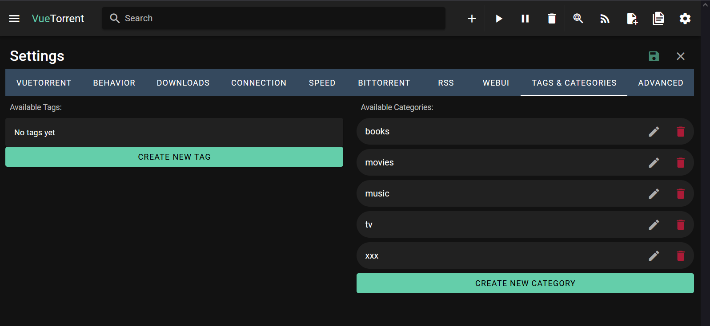
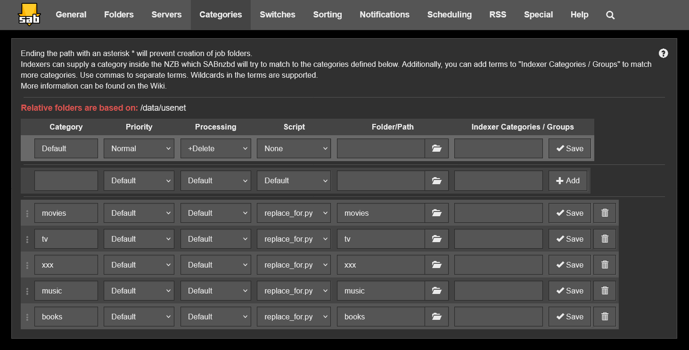
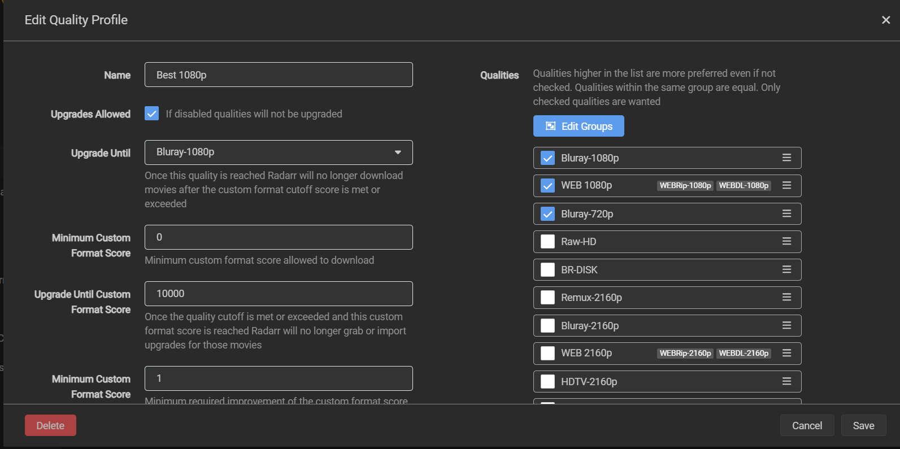
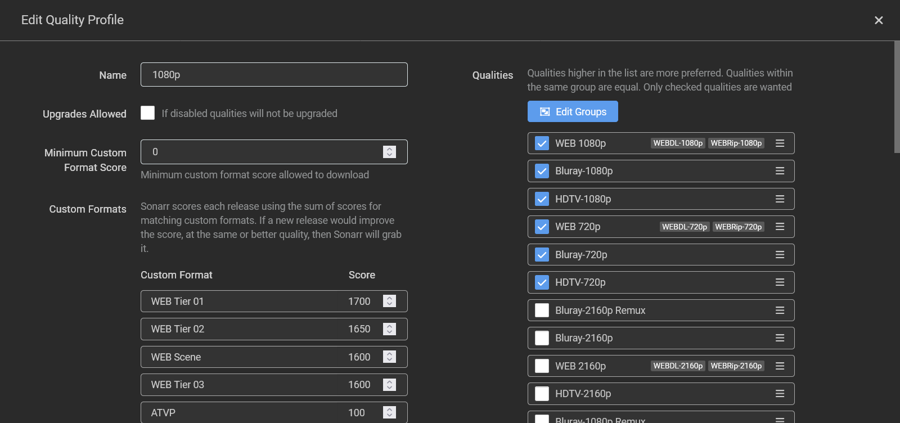
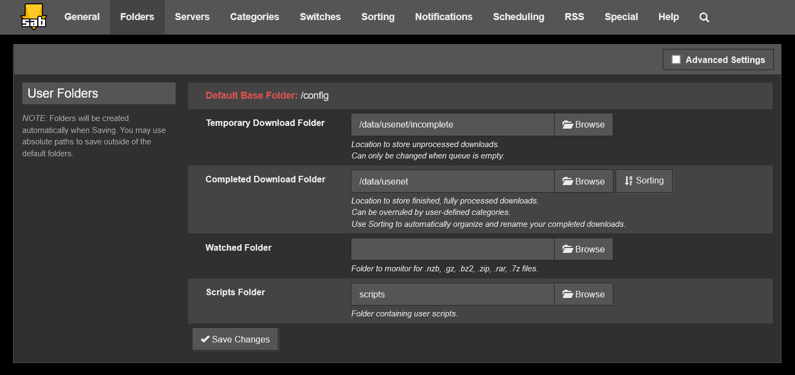

# Installation

**Table of Contents:**
- [Installation](#installation-1)
- [Chart customization](#chart-customization)
    - [Environment variables](#environment-variables)
- [Do not run containers as root. File permissions](#do-not-run-containers-as-root-file-permissions)
- [Folder Structure](#folder-structure)
- [Hard links](#hard-links)
- [Cert-manager](#cert-manager)
- [Authentik](#authentik)
    - [Setup](#setup)
- [Homepage](#homepage)
- [Radarr](#radarr)
    - [Hardlinks](#hardlinks)
    - [Profile](#profile)
    - [Proxy](#proxy)
    - [Custom Formats](#custom-formats)
        - [HDR/DV](#hdrdv)
        - [Teaser/Trailer](#teasertrailer)
- [Sonarr](#sonarr)
    - [Hardlinks](#hardlinks-1)
    - [Profile](#profile-1)
    - [Proxy](#proxy-1)
    - [Custom Formats](#custom-formats-1)
- [Prowlarr](#prowlarr)
- [Plex](#plex)
    - [Setup](#setup-1)
- [Jellyfin](#jellyfin)
- [Jellyseerr](#jellyseerr)
    - [Setup](#setup-2)
- [qBittorrent](#qbittorrent)
- [SABnzbd](#sabnzbd)
- [Flaresolverr](#flaresolverr)
    - [Proxy](#proxy-2)
- [Speedtest tracker](#speedtest-tracker)
- [Stirling PDF](#stirling-pdf)
- [Huginn](#huginn)
- [Changedetectionio](#changedetectionio)
- [Archivebox](#archivebox)
- [Apprise](#apprise)
- [Gotify](#gotify)
- [Kometa](#kometa)
- [The Lounge](#the-lounge)
- [Kavita](#kavita)

## Installation

Prerequisites:
1. Kubernetes cluster with 1 node ([k3s](https://k3s.io/) is recommended)
2. Your own domain
3. Having delegated the domain to Cloudflare
4. Having set up A/CNAME DNS records, pointing to the IP address of your server
5. Cloudflare API Token, which you can create in User Profile > API Tokens > API Tokens. We'll use this token for a [DNS01](https://cert-manager.io/docs/configuration/acme/dns01/) challenge when obtaining a wildcard TLS certificate. Set token permissions as follows:
    - Permissions:
        - Zone - DNS - Edit
        - Zone - Zone - Read
    - Zone Resources:
        - Include - All Zones

Copy `authentik-values.template.yaml` to `authentik-values.yaml` and set the following *required* parameters:
```yaml
authentik:
    secret_key: # REQUIRED; generate via `pwgen -s -B -n 50 1`
    postgresql:
        password: # REQUIRED; set the same value as in postgresql.auth.password
server:
    ingress:
        hosts:
            - "" # REQUIRED; MUST be set to 'authentik.<domain>.<tld>', e.g. 'authentik.example.com'
postgresql:
    auth:
        password: # REQUIRED; generate via `pwgen -s -B -n 50 1`
```

Copy `certmanager-values.template.yaml` to `certmanager-values.yaml`. No required parameters to set here.

Copy `values.template.yaml` to `values.yaml` and set the following *minimum required* parameters:
```yaml
host:
    tz: # REQUIRED; e.g. 'Europe/Berlin'
    uid: # REQUIRED; obtain via `id -u`
    gid: # REQUIRED; obtain via `id -g`
certmanager:
    acme:
        email: # REQUIRED; e.g. 'example@gmail.com'
        dns01:
            cfApiToken: # REQUIRED
ingress:
    domain: # REQUIRED; e.g. 'example.com' (without a scheme)
```

The user with the specified UID/GID must exist on the host machine and should be unprivileged. See the [File permissions](#do-not-run-containers-as-root-file-permissions) section for details.

Finally, install the server:
```sh
./bin/install.sh
```

The script will install the [cert-manager](https://artifacthub.io/packages/helm/cert-manager/cert-manager/), the [Authentik](https://artifacthub.io/packages/helm/goauthentik/authentik), and finally this Helm chart. Give it a couple of minutes to spin up and self-initialize.
If you want to customize cert-manager or Authentik before installation, please adjust `certmanager-values.yaml` or `authentik-values.yaml` respectively. This requires you to be familiar with these charts. Otherwise don't touch anything but required params.

After installation, please carry out all the steps from the [#cert-manager](#cert-manager) and [#Authentik](#authentik) sections below.

Having verified that cert-manager and Authentik are functioning properly, you can proceed to enabling individual services.
All services are optional. Just enable the ones you need.

Service sections in `values.yaml` should be self-explanatory since all important variables are documented. The required parameters are marked with a `# REQUIRED` commment, the rest can be left default or changed to your liking. Make sure that directories used by a service do actually exist on the host and are owned by the same user and group you specified in `host.uid`/`host.gid`.

This document covers most of the services used in this chart and provides some useful notes. Return to this document if you're having troubles. Open an issue in this GitHub repo if your problem is not covered here. Please ensure that it's an indeed chart's issue and always read the service's docs first.

If you're a newbie, it's especially worth to give this document a read from start to finish. It has detailed instructions for core services like [Plex](#plex), [Radarr](#radarr)/[Sonarr](#sonarr), [Jellyseerr](#jellyseerr), and [qBittorrent](#qbittorrent).

Have fun!

---

## Chart customization

Every service is customizable to great extent.
I tried to minimize the need for direct editing of the template files, leveraging Helm values for commonly used environment variables and settings.

Please refer to the respective section of any service in `values.template.yaml` - all values are described and documented over there.

Generally the service section adheres to the following format - read comments for explanations:
```yaml
services:
    homepage:
        enabled: true # controls if the service is enabled
        exposed: true # controls if the service is exposed externally through the ingress
        name: homepage # service name; controls the names of the created k8s services/pods/jobs, plus controls the subdomain address (`homepage.<ingress.domain>` in this case)
        replicaCount: 1 # number of deployment replicas; normally only one required for each service
        image:
            repository: ghcr.io/gethomepage/homepage # image name
            tag: latest # image tag (version)
            pullPolicy: Always # image pull policy
        ports:
            http: 3000 # port used by the respective k8s service; doesn't affect the container port as it's usually fixed and set by the image or service maintainer
        env: # custom env vars that will be passed as is to the respective pod
            VAR1: foo
            VAR2: |-
                foo
                bar
```

If you feel like there could be even more customization, please open an issue in this GitHub repo.

### Environment variables

Every service supports custom environment variables that are be passed as is to the respective pod.

Set `services.<service_name>.env` to a dictionary in the following format:
```yaml
services:
  service_name:
    env:
      VAR1: foo
      VAR2: |-
        multi-
        line
        env
        var
```

Note these custom env vars will *not* take precedence over those that are already set in the deployment's template. Please use the predefined variables instead.

For instance, Stirling-PDF can be customized this way:
```yaml
services:
  stirlingpdf:
    langs: "en_GB" # predefined var - maps to the 'LANGS' env var in the template
    env:
      # see the full list of supported env vars
      # https://github.com/Stirling-Tools/Stirling-PDF?tab=readme-ov-file#customisation
      #
      # a custom var passed as is to the pod's env vars
      UI_APP_NAME: "My very own Stirling PDF"
```

---

## Do not run containers as root. File permissions

This chart follows best security practices by not running the main container's process as root whenever possible.
This limits priviliges of the process even in case of breaking out of a container.

Moreover, the usage of a specific UID/GID (user/group id) facilitates the usage of [host path volumes](https://kubernetes.io/docs/concepts/storage/volumes/#hostpath) inside the containers without any file permission issues by matching the user who owns a directory on the host and the user inside a container.

That is to say, the only thing you should do is:
1. Set your *host* user's UID & GID in `host.uid` and `host.gid` respectively
    - You can obtain your user id via `id -u` and group id via `id -g`
    - *Attention!* Make sure the host user is unprivileged, i.e. doesn't have sudo permissions. Create a new user if needed. Make sure the UID/GID is not below `100`. This range is problematic because it's often already in use by an existing system user inside a container
2. Make sure any directories you create and use in your `values.yaml` are owned by this very user. Use `chmod -R <uid>:<gid> /dir`

---

## Folder Structure

Here's an overview of a folder structure that this chart dictates by default, meaning these paths are set in `values.template.yaml` and these paths are mentioned in all the service-specific sections below, but you're free to change the paths as you'd like:
```text
data
├── torrents
│   ├── movies
│   └── tv
│   ├── music
│   ├── books
│   └── xxx
├── usenet
│   ├── incomplete
│   └── complete
│       ├── movies
│       └── tv
│       ├── music
│       ├── books
│       └── xxx
└── library
    ├── movies
    └── tv
    ├── music
    ├── books
    └── xxx
```

The sub-folders for torrent downloads (movies, tv, etc.) are controlled by a download category you use. If you set a `movies` category for Radarr-initiated downloads, the respective `/data/torrents/movies` directory will be created by qBittorrent automatically. E.g. your qBittorrent setup can look like this:


The same applies to Usenet downloads. If you set a `movies` category for Radarr-initiated downloads, the respective `/data/usenet/movies` directory will be created by SABnzbd automatically. Note the categories must be pre-created first before setting up a download client in the *arr stack. E.g. your SABnzbd setup can look like this:


The data folder itself can be placed wherever you like. Personally, I put this in the root at `/data`.

---

## Hard links

You've probably heard about hard links in context of Radarr/Sonarr and Torrent clients.

Hardlinks is a way to have a file in multiple locations without using twice the storage. Practically, this will allow you to:
1. import downloaded movies into Plex instantly (without copying)
2. and without using twice the storage,
3. continue seeding in the torrent client even after importing,
4. remove a movie from the torrent client without impacting its copy in the Plex library, and vice versa

This chart fully supports hard links. If you have followed the [Radarr](#radarr)/[Sonarr](#sonarr)/[qBittorrent](#qbittorrent) instructions precisely, it's already working.

Just to double-check, here's what you need to do:
1. Radarr:
    - The Radarr container should have access to the `/data` directory on the host, i.e. `services.radarr.data=/data`
    - In Settings -> Media Management add a root folder with the path of `/data/library/movies`
2. Sonarr:
    - The Sonarr container should have access to the `/data` directory on the host, i.e. `services.sonarr.data=/data`
    - In Settings -> Media Management add a root folder with the path of `/data/library/tv`
3. qBittorrent:
    - The qBittorrent container should have access to the `/data/torrents` directory on the host, i.e. `services.qbittorrent.data=/data/torrents`
    - In Settings -> Downloads set `Default Save Path (complete)` to `/data/torrents`. Do not touch the other paths
4. SABnzbd
    - The SABnzbd container should have access to the `/data/usenet` directory on the host, i.e. `services.sabnzbd.data=/data/usenet`
    - In Settings -> Folders set `Completed Download Folder` to `/data/usenet/complete` and `Temporary Download Folder` to `/data/usenet/incomplete`
5. Plex:
    - The Plex container should have access to the `/data/library` directory on the host, i.e. `services.plex.library=/data/library`
    - Add 2 libraries:
        - `Movies` with the path of `/data/library/movies`
        - `TV Shows` with the path of `/data/library/tv`
    - The same applies to Jellyfin

The setup above implies you haven't changed the default paths set in `values.yaml`, otherwise use the ones you set.

How can you verify that hardlinks are working? Download any movie via Radarr, open a command line on your server and execute the following command:
```sh
$ ls -liR /data/library/movies
'/data/library/movies/John Wick Chapter 4 (2023)':
total 22884576
4849714 -rw-r--r-- 2 jelly jelly 23433785758 Oct  2 21:42 'John Wick Chapter 4 (2023) {tmdb-603692} [Bluray-1080p][EAC3 5.1][x264]-SPHD.mkv'
                   ^
                   |
                   |
```

The third column shows the number of hardlinks. If this number equals `2`, you're good. In case you were wondering where the second hardlink lies, it's `/data/torrents/radarr/`, i.e. the torrent client continues seeding:
```sh
$ ls -li /data/torrents/radarr/
4849714 -rw-r--r-- 2 jelly jelly 23433785758 Oct  2 21:42 John.Wick.Chapter.4.2023.1080p.BluRay.DDP.7.1.x264-SPHD_EniaHD.mkv
```

Note the number in the first column - `4849714`. It's an *[inode](https://en.wikipedia.org/wiki/Inode)* number, which is the same for these 2 files.

By the way, data won't be deleted from your filesystem until you delete all the hardlinks. Practically this means you have to delete a movie from both Radarr and qBittorrent whenever you want to claim back some space.

The above does not apply to SABnzbd as Usenet protocol doesn't even have a notion of seeding so there's no need to have multiple hardlinks. However, the *arr stack will still benefit from having an access to the whole data directory, since it'll be able to [move downloads instantly](https://trash-guides.info/File-and-Folder-Structure/Hardlinks-and-Instant-Moves/#what-are-instant-moves-atomic-moves).

---

## Cert-manager

The instructions below are absolutely necessary to carry out. Otherwise you might have issues connecting to your server.

First let's check that the certificate has been issued correctly:
```sh
kubectl describe certificate
```

A healthy output would be:
```yaml
Name:         certs.letsencrypt.key.tls
Namespace:    homeserver
Labels:       app.kubernetes.io/managed-by=Helm
              app.kubernetes.io/name=ingress
Annotations:  <none>
API Version:  cert-manager.io/v1
Kind:         Certificate
Metadata:
  Creation Timestamp:  2024-10-01T14:05:20Z
  Generation:          1
  Owner References:
    API Version:           networking.k8s.io/v1
    Block Owner Deletion:  true
    Controller:            true
    Kind:                  Ingress
    Name:                  ingress
    UID:                   cd6653b6-fa75-46b1-950b-9f0e6606279c
  Resource Version:        31289
  UID:                     67a18d86-1995-46b0-9bd6-d480c2a197fd
Spec:
  Dns Names:
    <domain>.<tld>
    *.<domain>.<tld>
  Issuer Ref:
    Group:      cert-manager.io
    Kind:       ClusterIssuer
    Name:       letsencrypt-cert-issuer
  Secret Name:  certs.letsencrypt.key.tls
  Usages:
    digital signature
    key encipherment
Status:
  Conditions:
    Last Transition Time:  2024-10-01T14:08:01Z
    Message:               Certificate is up to date and has not expired
    Observed Generation:   1
    Reason:                Ready
    Status:                True
    Type:                  Ready
  Not After:               2024-12-30T13:09:29Z
  Not Before:              2024-10-01T13:09:30Z
  Renewal Time:            2024-11-30T13:09:29Z
  Revision:                1
```

if no certificates found, wait a few more minutes until cert-manager finishes its job. If output is still empty, `Status.Conditions.Message` is not `Certificate is up to date and has not expired`, or there are errors in the Events, then something went wrong. Check the cert-manager's logs:
```sh
kubectl -n cert-manager logs -l app=certmanager
```

Let's conduct one more check via `openssl`:
```sh
openssl s_client -servername <domain.tld> -connect <domain.tld>:443
```

A healthy output would start with:
```text
CONNECTED(00000003)
depth=2 C = US, O = Internet Security Research Group, CN = ISRG Root X1
verify return:1
depth=1 C = US, O = Let's Encrypt, CN = R10
verify return:1
depth=0 CN = <domain>.<tld>
verify return:1
---
Certificate chain
 0 s:CN = <domain>.<tld>
   i:C = US, O = Let's Encrypt, CN = R10
   a:PKEY: rsaEncryption, 2048 (bit); sigalg: RSA-SHA256
   v:NotBefore: Oct  1 13:09:30 2024 GMT; NotAfter: Dec 30 13:09:29 2024 GMT
 1 s:C = US, O = Let's Encrypt, CN = R10
   i:C = US, O = Internet Security Research Group, CN = ISRG Root X1
   a:PKEY: rsaEncryption, 2048 (bit); sigalg: RSA-SHA256
   v:NotBefore: Mar 13 00:00:00 2024 GMT; NotAfter: Mar 12 23:59:59 2027 GMT
...
```

If you see `Let's Encrypt` and your domain in the output, then everything works properly. No need to do anything.

Great. Your root domain and sub-domains are secure now. The TLS certificate will be renewed automatically before expiration. If you want to learn more about this topic, please refer to the [cert-manager docs](https://cert-manager.io/docs/).

---

## Authentik

The instructions below are absolutely necessary to carry out. Otherwise you will have issues accessing your services.

### Setup

Go to `https://authentik.<domain>.<tld>/if/flow/initial-setup/` and carry out the initial setup, creating the admin user.

Now go to `https://authentik.<domain>.<tld>`, log in via the newly created admin user, and open the Admin Dashboard.

Go to Applications, click `Create with Wizard` and set settings as follows:
1. Application Details:
    - Name: `Homeserver`
2. Provider type:
    - Select `Forward Auth (Domain Level)`
3. Provider Configuration:
    - Name: `Homeserver`
    - Authentication flow: `default-authentication-flow (Welcome to authentik!)`
    - Authorization flow: `default-provider-authorization-implicit-consent (Authorize Application)`
    - External host: `authentik.<domain>.<tld>`
    - Cookie domain: `<domain>.<tld>`
    - Token validity: `hours=168` (1 week; you can select any value to your liking)
    - Advanced protocol settings:
        - Unauthenticated paths:
            ```text
            plex.<domain>.<tld>
            jellyfin.<domain>.<tld>
            jellyseerr.<domain>.<tld>
            ```
4. Click Submit

Now go to Flows and Stages -> Outposts, select `authentik Embedded Outpost`, click `Edit` and move our application to the right pane (from Available to Selected).

Next we want to allow the users you share your Plex Media Server with to log in via their Plex account. Go to Directory -> Federations and Social login and click `Create`. Set settings as follows:
1. Select type
    - Select `Plex Source`
2. Create Plex Source
    - Name: `Plex`
    - Icon: leave empty to use the Authentik's default Plex icon, or type in the URL to your own icon. Personally, I like the look of [Self-Hosted Dashboard Icons](https://selfh.st/icons/), including their [Plex icon](https://cdn.jsdelivr.net/gh/selfhst/icons/svg/plex.svg) specifically
    - Protocol settings:
        - Click `Load servers` and log in via the Plex account for which you claimed a Plex Media Server
        - Optional: Switch off `Allow friends to authenticate via Plex, even if you don't share any servers` in order to forbid your friends you DON'T share your Plex Media Server with to log in

Now go to Flows and Stages -> Stages, select `default-authentication-identification`, click Edit and move the newly created Plex source to the right pane (from Available to Selected).

Give it a couple of minutes for changes to take effect. Log out of your admin account and verify that Plex-based authentication is working by going to one of the services (e.g. `radarr.<domain>.<tld>`) and trying to log in via your Plex account.

Great. Now we have a working SSO authentication.

Note that not every service (e.g. Huginn) supports disabling of the built-in authentication or using a proxy authentication (mapping an Authentik's user to an internal service's user by the usage of an http header; e.g. see the Miniflux setup).

There's no easy solution to this.
You will have to either log in twice or bypass such a service in Authentik completely. By going the latter way you'll be only relying on whatever auth system that service provides, which may contain its own security flaws. Personally, I still keep such services behind Authentik because it only requires you to login once and a session is usually kept for a long time (weeks or even months depending on your setup).

Actually, sometimes you want to keep internal service's auth in case it allows you to have different user "profiles". Once again, an example of such a service is Huginn. This might be benefitable when you're not the only user of your home server.

---

## Homepage

Available at `homepage.<domain>.<tld>` and at the root domain `<domain>.<tld>` by default (the service to serve on the root domain can be controlled via `ingress.rootService`).

Any `.yaml` files you put in the directory `files/homepage`  will be dynamically loaded into the config directory inside the container and used by Homepage if they follow proper name conventions (`settings.yaml`, `widgets.yaml`, etc.). Note the file hierarchy must be flat.
These files are Helm template files, so you can reference any Helm value as you would do normally in a template.

I provided some sensible default configuration files at `files/homepage/default`. They are not used by default. You can either copy them to `files/homepage` and tune them to your liking or create your own config files from scratch (see the official [Homepage docs](https://gethomepage.dev/configs/)).

---

## Radarr

Available at `radarr.<domain>.<tld>`.

### Hardlinks

To enable [hardlinks](https://trash-guides.info/File-and-Folder-Structure/Hardlinks-and-Instant-Moves/), all of the steps below must be carried out:
1. Ensure the Radarr container has access to the whole `/data` directory on the host, meaning you've set `services.radarr.data=/data`
2. Ensure the `/data` directory is owned by the same user and group you specified in `host.uid`/`host.gid`:
    ```sh
    sudo chown -R <uid>:<gid> /data
    sudo chmod -R a=,a+rX,u+w,g+w /data
    ```
3. Go to Settings -> Media Management, Importing, and ensure `Use Hardlinks instead of Copy` is checked
4. Go to Settings -> Media Management, Root Folders, and add a Root Folder with the path of `/data/library/movies`. The directory must be pre-created manually first. This is the path which you'll also use in Plex when adding a Movies library

### Profile

One of the most important parts of the whole stack. Configuring your profile properly will get you movies in the best possible quality, filtering out low-quality and unwanted releases.

First we need to set up [Naming Scheme](https://trash-guides.info/Radarr/Radarr-recommended-naming-scheme/) and [Quality Settings](https://trash-guides.info/Radarr/Radarr-Quality-Settings-File-Size/). Please carry out these guides before continuing.

Now we can start creating our perfect profile. We'll take the Trash Guides' profiles as a base - select one of the following:
- [HD Bluray + WEB](https://trash-guides.info/Radarr/radarr-setup-quality-profiles/#hd-bluray-web) - if you prefer HD quality (Bluray-720p/1080p). Size: ~6-15 GB depending on the runtime
- [UHD Bluray + WEB](https://trash-guides.info/Radarr/radarr-setup-quality-profiles/#uhd-bluray-web) - if you prefer UHD quality (Bluray-2160p). Size: ~20-60 GB depending on the runtime
- [Remux + WEB 1080p](https://trash-guides.info/Radarr/radarr-setup-quality-profiles/#remux-web-1080p) - if you prefer Remux-1080p quality. Size: ~20-40 GB depending on the runtime
- [Remux + WEB 2160p](https://trash-guides.info/Radarr/radarr-setup-quality-profiles/#remux-web-2160p) - if you prefer Remux-2160p quality. Size: ~40-100 GB depending on the runtime

> [!WARNING]
> Carry out ALL the steps from the guides above. Don't leave out a single step. The Trash Guides' profiles is the best you can get out of Radarr.

Now let's customize our profile a bit:
1. Optional: disable quality upgrade. Personally I never needed this
2. Add a few custom formats:
    - [Teaser/Trailer](#teasertrailer) with a score of `-10000` - to filter out teasers & trailers (do you really need them?)
    - [HDR/DV](#hdrdv) with a score of `-10000` - to filter out HDR/DV movies
        - *Attention!* If your devices support HDR/DV, DO NOT add this format. Actually you WANT Radarr to prefer HDR releases over regular ones because the former ones always look better.
          Luckily, this is easily achievable with the help of custom formats and Radarr's scoring system. Add all of the custom HDR formats from this guide [How to set up Quality Profiles#HDR Formats](https://trash-guides.info/Radarr/radarr-setup-quality-profiles/#hdr-formats) and set their score as described
    - Flexible language selection. There's nothing wrong with the built-in language selection, but it works as a "only" filter. Sometimes you want something more flexible, e.g. you *prefer* German but are also okay with English. Custom formats allow us to implement this strategy. Once again, I'll refer you to Trash Guides. Use one of the following formats:
        - [Language: Original Only](https://trash-guides.info/Radarr/Tips/How-to-setup-language-custom-formats/#language-original-only)
            > With this Custom Format, you will get only the Movie/TV Show with the original language.
        - [Language: X Only](https://trash-guides.info/Radarr/Tips/How-to-setup-language-custom-formats/#language-english-only)
            > With this Custom Format you will only get the Movie/TV Show in the English language or any other language of your selection. Please adjust the format accordingly.
        - [Language: Multiple Only](https://trash-guides.info/Radarr/Tips/How-to-setup-language-custom-formats/#language-multiple-only)
            > With this Custom Format, you will only get the Movie/TV Show with X and/or Y Audio.
        - [Language: Prefer X but i'll take Y](https://trash-guides.info/Radarr/Tips/How-to-setup-language-custom-formats/#language-prefer-x-but-ill-take-y)
            > Let's say you want German, but if German is not available then fall back to Original language but don't accept any other translated languages.
        - [Language: Prefer Language X](https://trash-guides.info/Radarr/Tips/How-to-setup-language-custom-formats/#language-prefer-language-x) -
            > Let's say you just want to prefer German and don't care if you get another random language(s).
        - [Language: Prefer Multi Language](https://trash-guides.info/Radarr/Tips/How-to-setup-language-custom-formats/#language-prefer-multi-language)
            > With this Custom Format, you will only get the Movie/TV Show with either Preferred Language.

In the end your profile should look like this:



---

### Proxy

There's an option to enable proxy. Go to Settings -> General and scroll down to the Proxy section.

You want this if your movie search requests in Radarr fail due to GeoIP reasons, especially if you're from Russia/Belarus [since these countries are banned in Radarr](https://wiki.servarr.com/radarr/troubleshooting#invalid-response-received-from-tmdb).

If you want a good proxy recommendation, there's [Privoxy](http://www.privoxy.org/) and more lightweight [Tinyproxy](https://tinyproxy.github.io/).

---

### Custom Formats

These are simple custom formats that I've accumulated over time. Feel free to use them if you find them useful.

#### HDR/DV

```json
{
  "name": "HDR/DV",
  "includeCustomFormatWhenRenaming": false,
  "specifications": [
    {
      "name": "HDR/DV",
      "implementation": "ReleaseTitleSpecification",
      "negate": false,
      "required": true,
      "fields": {
        "value": "\\b(dv|dovi|dolby[ .]?v(ision)?|hdr(10(P(lus)?)?)?|pq)\\b"
      }
    }
  ]
}
```

---

#### Teaser/Trailer

```json
{
  "name": "Teaser/Trailer",
  "includeCustomFormatWhenRenaming": false,
  "specifications": [
    {
      "name": "Teaser/Trailer",
      "implementation": "ReleaseTitleSpecification",
      "negate": false,
      "required": true,
      "fields": {
        "value": "\\b(Teaser|Trailer)\\b"
      }
    }
  ]
}
```

---

## Sonarr

Available at `sonarr.<domain>.<tld>`.

Sonarr is very similar to Radarr in terms of UI and capabilities. In fact, Radarr is a fork of Sonarr.

### Hardlinks

To enable [hardlinks](https://trash-guides.info/File-and-Folder-Structure/Hardlinks-and-Instant-Moves/), all of the steps below must be carried out:
1. Ensure the Sonarr container has access to the whole `/data` directory on the host, meaning you've set `services.sonarr.data=/data`
2. Ensure the `/data` directory is owned by the same user and group you specified in `host.uid`/`host.gid`:
    ```sh
    sudo chown -R <uid>:<gid> /data
    sudo chmod -R a=,a+rX,u+w,g+w /data
    ```
3. Go to Settings -> Media Management, Importing, and ensure `Use Hardlinks instead of Copy` is checked
4. Go to Settings -> Media Management, Root Folders, and add a Root Folder with the path of `/data/library/tv`. The directory must be pre-created manually first. This is the path which you'll also use in Plex when adding a TV Series library

### Profile

Unfortunately there's no easy way to sync Radarr and Sonarr profiles, so you'll have to copy-paste custom formats once again. Luckily, this is a one time job. The profile will serve you well and reliably, having set it up once.

Ensure to set up [Naming Scheme](https://trash-guides.info/Sonarr/Sonarr-recommended-naming-scheme/) and [Quality Settings](https://trash-guides.info/Sonarr/Sonarr-Quality-Settings-File-Size/) first.

We'll take Trash Guides' profiles as a base - select one of the following:
- [WEB-1080p](https://trash-guides.info/Sonarr/sonarr-setup-quality-profiles/#web-1080p) - if you prefer 720p/1080p WEBDL quality
- [WEB-2160p](https://trash-guides.info/Sonarr/sonarr-setup-quality-profiles/#web-2160p) - if you prefer 2160p WEBDL quality

Customize the profile similarily to Radarr: add/exclude HDR formats and implement flexible language selection.

In the end your profile should look like this:



### Proxy

Sonarr supports proxy too. The setup process is identical to Radarr - refer to [Radarr#proxy](#proxy).

### Custom Formats

Sonarr supports the same custom formats as Radarr does. Refer to [Radarr#custom-formats](#custom-formats).

---

## Prowlarr

Available at `prowlarr.<domain>.<tld>`.

Prowlarr is an indexer manager that allows you to sync your indexers across all of the *arr stack.

Let's set up one basic torrent indexer (1337x, a torrent tracker), Flaresolverr, and our *arr apps to sync indexers to.

Flaresolverr:
1. Go to Settings -> Indexers
2. Click the big plus button and select FlareSolverr
3. Set settings as follows:
    - Tags: `flaresolverr`
    - Host: `http://flaresolverr:8191/`
    - Request Timeout: `120`
4. Click `Test` and `Save`

Indexer:
1. Go to Indexers
2. Click `Add Indexer` (the plus button)
3. Search for `1337` and click on the entry shown below
4. Set settings as follows:
    - Name: `1337x`
    - Sync Profile: `Standard`
    - Download link: `iTorrents.org`
    - Download link (fallback): `magnet`
    - Sort requested from site: `created`
    - Order requested from site: `desc`
    - Tags: `flaresolverr`
5. Click `Test` and `Save`

Arr Apps:
1. Go to Settings -> Apps
2. Set up Radarr:
    1. Click the big plus button and select Radarr
    2. Set settings as follows:
        - Name: `Radarr`
        - Sync Level: `Full Sync`
        - Prowlarr Server: `http://prowlarr:9696`
        - Radarr Server: `http://radarr:7878`
        - API Key: go to `radarr.<domain>.<tld>/settings/general`, retrieve the API Key and paste it here
    3. Click `Test` and `Save`
3. Set up Sonarr:
    1. Click the big plus button and select Sonarr
    2. Set settings as follows:
        - Name: `Sonarr`
        - Sync Level: `Full Sync`
        - Prowlarr Server: `http://prowlarr:9696`
        - Radarr Server: `http://sonarr:8989`
        - API Key: go to `sonarr.<domain>.<tld>/settings/general`, retrieve the API Key and paste it here
    3. Click `Test` and `Save`

Great. Now your indexers will be automatically synced to Radarr and Sonarr. This is the time to add some other indexers of your liking before moving on.

For detailed info refer to the [Trash Guides](https://trash-guides.info/Prowlarr/) and official [Servarr Wiki](https://wiki.servarr.com/en/prowlarr).

---

## Plex

Available at `plex.<domain>.<tld>`.

### Setup

Go to `https://plex.<domain>.<tld>/web` and carry out the initial setup.

Now we need to configure the Plex instance properly. I'll redirect you to *TRaSH Guides*, the awesome resource which covers the whole *arr stack and popular torrent/usenet downloaders. I can't appreciate it enough how much it helped me initially.

Follow this guide - [Trash Guides#Suggested Plex Media Server Settings](https://trash-guides.info/Plex/Tips/Plex-media-server/). Note that some settings might be missing if you don't have an active Plex Pass subscription.

Ensure that you've set up the libraries as follows:
1. Movies:
    - Scanner: `Plex Movie`
    - Agent: `Plex Movie`
    - Folders: `/data/library/movies`
2. TV Shows:
    - Scanner: `Plex TV Series`
    - Agent: `Plex Series`
    - Folders: `/data/library/tv`

---

## Jellyfin

Available at `jellyfin.<domain>.<tld>`.

See the official docs at <https://jellyfin.org/docs/>.

---

## Jellyseerr

Available at `jellyseerr.<domain>.<tld>`.

Jellyseerr is a customizable request system, which allows users to request movies & series in a easy-to-use and mobile-friendly interface. Jellyseerr integrates tightly with Radarr and Sonarr, putting download requests into the respective service. Jellyseerr is a fork of [Overseerr](https://github.com/sct/overseerr), but actively maintained. Plus, Jellyseerr supports Jellyfin and Emby in addition to Plex (just in case you'll want to ditch Plex).


### Setup

I'll only list the most important settings here. Adjust the rest of the settings to your liking.

Users tab:
1. Uncheck `Enable Local Sign-In`. I see no point in using local users when they can log in via their Plex account
2. Uncheck `Enable New Plex Sign-In`. Given that Jellyseerr is not covered by Authentik (on purpose), you don't want to let strangers mess around
3. Default Permissions:
    - Check `Request`
    - Optional: check `Auto-Approve` if you don't care what your users request. Leave unchecked if you want a full control over all requests
    - Optional: check `Auto-Request` if you want to allow users to automatically request the movies and TV shows from their Plex watchlist
    - The rest of the permissions you probably want to leave unchecked

Plex tab:
1. Plex settings:
    - Hostname or IP address: `http://plex`
    - Port: `32400`
    - Click `Save Changes` - you'll see a `Plex connection established successfully!` notification
2. Plex Libraries:
   - Click `Sync Libraries`
   - Check all the libraries that appeared underneath
   - Manual Library Scan:
       - Click `Start Scan`
3. Tautulli Settings:
    - Hostname or IP Address: `http://tautulli`
    - Port: `8181`
    - API Key: go to `https://tautulli.<domain>.<tld>`, Settings -> Web Interface and retrieve the API key. Make sure `Enable API` is checked
    - Click `Save Changes` - you'll see a `Tautulli settings saved successfully!` notification

Services tab:
1. Radarr Settings:
    - Click `Add Radarr Server`
    - Check `Default Server`
    - Server name: `Radarr`
    - Hostname or IP address: `http://radarr`
    - Port: `7878`
    - API Key: go to `https://radarr.<domain>.<tld>`, Settings -> General and retrieve the API key
    - Click `Test` in the very bottom
    - Quality Profile: select the profile you set up earlier
    - Root Folder: `/data/library/movies`
    - Minimum Availability: `Released`
    - External URL: `https://radarr.<domain>.<tld>`
    - Check `Enable Scan`
    - Check `Automatic Search`
    - Click `Save Changes`
2. Sonarr Settings:
    - Click `Add Sonarr Server`
    - Check `Default Server`
    - Server name: `Sonarr`
    - Hostname or IP address: `http://sonarr`
    - Port: `8989`
    - API Key: go to `https://sonarr.<domain>.<tld>`, Settings -> General and retrieve the API key
    - Click `Test` in the very bottom
    - Quality Profile: select the profile you set up earlier
    - Root Folder: `/data/library/tv`
    - Language Profile: `Deprecated`
    - External URL: `https://sonarr.<domain>.<tld>`
    - Check `Enable Scan`
    - Check `Automatic Search`
    - Click `Save Changes`

Great. Now anytime a user requests a media Jellyseerr will put a request to the respective service: Radarr for movies or Sonarr for TV Series.

---

## qBittorrent

Available at `torrent.<domain>.<tld>`.

Basic setup: follow the Trash Guides - <https://trash-guides.info/Downloaders/qBittorrent/Basic-Setup/>.

After finishing the guide above adjust the following settings as well:
1. Advanced:
    - Torrent content removing mode: `Delete files permanently`
    - Click `Save`
2. Downloads:
    - Saving Management:
        - Default Torrent Management Mode: `Automatic`
        - When Torrent Category changed: `Relocate torrent`
        - When Default Save Path changed: `Relocate affected torrents`
        - When Category Save Path changed: `Relocate affected torrents`
        - Default Save Path: `/data/torrents` (controlled via `services.qbittorrent.data`)
    - Click `Save`
3. WebUI:
    - Authentication:
        - Check `Bypass authentication for clients on localhost`
        - Check `Bypass authentication for clients in whitelisted IP subnets` and type in the following IP subnet in the box below: `10.42.0.0/16`. This (private) IP address range is used by Kubernetes pods and this will allow the services like Radarr, Sonarr, and Prowlarr to interact with qBittorrent without auth
    - Optional: Check `Use alternative WebUI` and type in the following in the box below: `/vuetorrent`. This will enable the alternative WebUI, [VueTorrent](https://github.com/VueTorrent/VueTorrent), which is more user/mobile-friendly
    - Click `Save`

Now you need to allow the torrenting p2p port in your firewall, if you have one enabled. Otherwise you won't be considered an "active" seed, i.e. peers with a closed port won't be able to connect to you, which means you'll seed less and slower. By default this port is `32700`. This value may be controlled via `services.qbittorrent.ports.p2p`. Note that the port must be in the range of `30000-32767` (see [Kubernetes#NodePort](https://kubernetes.io/docs/concepts/services-networking/service/#type-nodeport)).

For Debian/Ubuntu execute the following command:
```sh
ufw allow 32700/tcp
ufw allow 32700/udp
```

---

## SABnzbd

Available at `usenet.<domain>.<tld>`.

Please refer to [Trash Guides](https://trash-guides.info/Downloaders/SABnzbd/Basic-Setup/) for setup instructions.

After finishing the guide above, make sure the temporary and completed download folders are set as follows:


You also need to set up categories for usage in the *arr stack:


This chart includes a few useful scripts found at [Trash Guides#SABnzbd Scripts](https://trash-guides.info/Downloaders/SABnzbd/scripts/). They are mapped at `/config/scripts`:
- [Clean.py](https://trash-guides.info/Downloaders/SABnzbd/scripts/#clean)
    - Set this script as a `Pre-queue script` in Settings -> Switches. Make sure you enabled Advanced Settings, otherwise you won't see this setting
- [replace_for.py](https://trash-guides.info/Downloaders/SABnzbd/scripts/#replace_for)
    - Set this script in Settings -> Categories for each category (movies, tv, etc.)

---

## Flaresolverr

Flaresolverr allows indexers to bypass Cloudflare captcha on such trackers as 1337x.

Setup instructions are covered in the [Prowlarr](#prowlarr) section.

### Proxy

Even though Flaresolverr [has support](https://github.com/FlareSolverr/FlareSolverr?tab=readme-ov-file#-sessionscreate) for proxy server, there's no direct control over it in the Prowlarr settings.

However if you set up a proxy in the Prowlarr settings (Settings -> General), it will be used by Flaresolverr as well. This isn't documented, but it works. You can verify that by looking at the Flaresolverr logs - `kubectl logs -l app.kubernetes.io/name=flaresolverr`.

This means you can bypass both GeoIP restrictions and captcha when using Flaresolverr solely.

---

## Speedtest tracker

Available at `speedtest.<domain>.<tld>`.

The [default admin's](https://docs.speedtest-tracker.dev/security/authentication#default-user-account) username is `admin@example.com` and password is `password`.

---

## Stirling PDF

Available at `pdf.<domain>.<tld>`.

Note that the login feature is disabled by default as this service is already protected by Authentik. You can enable it by setting `services.stirlingpdf.enableLogin=true`.

---

## Huginn

Available at `huginn.<domain>.<tld>`.

The default username is `admin` and password is `password`. Please change the credentials shortly after installation.

Unfortunately there's no way to disable auth or use forward auth, so you probably want to disable Authentik for Huginn and use the built-in auth system solely.
This is especially true if you expect to run webhooks since Authentik would interfere with third-party services pushing updates to your instance.
Don't forget to set `services.huginn.invitationCode` to a cryptographically secure random value. This will keep the strangers away from using your Huginn instance since it'll require them to have an invitation code to sign up.

---

## Changedetectionio

Available at `changedetection.<domain>.<tld>`.

Note that the playwright service (`services.playwright`) must be enabled in order to use the [Chrome/Javascript fetch method](https://github.com/dgtlmoon/changedetection.io/wiki/Playwright-content-fetcher).

---

## Archivebox

Available at `archivebox.<domain>.<tld>`.

See the official docs at <https://github.com/ArchiveBox/ArchiveBox/wiki>.

The default admin's username is `admin` and password is `admin`. These values can be controlled via `service.archivebox.adminUsername` and `service.archivebox.adminPassword`. The default user is only created on the first run, so make sure to adjust these values beforehand.

## Apprise

Available at `apprise.<domain>.<tld>`.

See the official docs at <https://github.com/caronc/apprise-api>.

---

## Gotify

Available at `gotify.<domain>.<tld>`.

See the official docs at <https://gotify.net/docs/index>.

The default admin's username is `admin` and password is `admin`. These values can be controlled via `service.gotify.adminUsername` and `service.gotify.adminPassword`. The default user is only created on the first run, so make sure to adjust these values beforehand.

---

## Kometa

Available at `kometa.<domain>.<tld>`.

See the official docs at <https://kometa.wiki>.

Any `.yaml` files you put in the directory `files/kometa` will be dynamically loaded into the config directory inside the container and used by Kometa if they follow proper name conventions. Note the file hierarchy should be flat.
These files are Helm template files, so you can reference any Helm value as you would do normally in a template.

I provided some sensible default configuration files at `files/kometa/default`. They are not enabled by default. You can either copy them to `files/kometa` and tune them to your liking or create your own config files from scratch (see the official [Kometa wiki](https://kometa.wiki)).

Make sure to actually put a config file named `config.yaml` into `files/kometa`, otherwise Kometa won't be working.

You can verify that Kometa is working by running a test job:
```sh
kubectl create job --from=cronjob.batch/kometa kometa-test-run
kubectl logs -f jobs/kometa-test-run
```

---

## The Lounge

Available at `thelounge.<domain>.<tld>`.

You must add a user in order to have persistent channels and history.
Otherwise all of your channels will be lost once you exit the client.

Here's what you need to do:
1. Open `/config/config.js` with your editor and set `public: false`
2. Restart the container: `kubectl rollout restart deployment thelounge`
3. Add a new user: `kubectl exec -it deployment/thelounge -- s6-setuidgid abc thelounge add <username>`
    - You will be asked for a password that won't be echoed
    - Enable persistent logs to have a history schollback
    - You'll see the following output on successful creation:
        ```text
        2024-10-22 03:01:20 [PROMPT] Enter password:
        2024-10-22 03:01:30 [PROMPT] Save logs to disk? (yes) yes
        2024-10-22 03:01:33 [INFO] User <username> created.
        2024-10-22 03:01:33 [INFO] User file located at /config/users/<username>.json.
        ```

---

## Kavita

Available at `kavita.<domain>.<tld>`.

See the official docs at <https://wiki.kavitareader.com/guides>.

---
